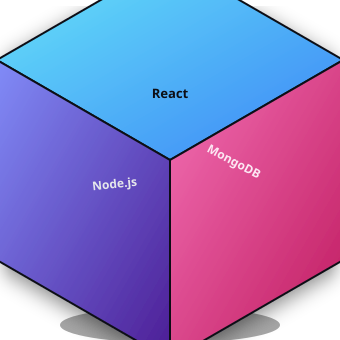
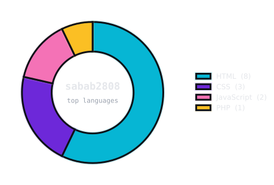

[README (2).md](https://github.com/user-attachments/files/30633061/README.2.md)

 

 

 

## 🧑‍💻 01 &nbsp;/&nbsp; About Me

<table>
<tr>
<td width="62%" valign="top">

- 🎓 **B.Sc. in CSE** — Daffodil International University *(2023 – 2026)*
- 💼 Building **HostelMania** — a full-stack hostel food platform with auth, role-based access & Stripe payments
- 🌱 Currently sharpening **AI integration** & **cloud deployment** skills
- 🏆 **Executive Member**, Computer & Programming Club — helped run Typetrek, Takeoff, UTA & more
- 🤝 Volunteered at the **Bangladesh Olympiad in Informatics (BdOI)**
- 📍 Based in Mirpur, Dhaka, Bangladesh
- ⚡ Fun fact: I turn coffee, bugs, and deadlines into deployed apps

</td>
<td width="38%" valign="top" align="center">

always compiling, never sleeping

</td>
</tr>
</table>

## 🛠️ 02 &nbsp;/&nbsp; Tech Stack

<table width="100%">
<tr>
<td width="16%" valign="top" align="center"><b>LANGUAGES</b>  

</td>
<td width="21%" valign="top" align="center"><b>FRONTEND</b>  

</td>
<td width="16%" valign="top" align="center"><b>BACKEND</b>  

</td>
<td width="16%" valign="top" align="center"><b>DATABASE</b>  

</td>
<td width="21%" valign="top" align="center"><b>TOOLS</b>  

</td>
</tr>
</table>

## 📊 03 &nbsp;/&nbsp; GitHub Stats

<table>
<tr>
<td valign="top" width="50%">

</td>
<td valign="top" width="50%">

</td>
</tr>
</table>

  

> 💡 If a card looks blank on first load, refresh once — they render live and occasionally need a moment to warm up.

## 🏆 04 &nbsp;/&nbsp; GitHub Trophies

## 🚀 05 &nbsp;/&nbsp; Featured Projects

<table width="100%">
<tr>
<td width="33%" valign="top">

**🍔 HostelMania**
Full-stack hostel food management system: auth, role-based access, ordering flow & Stripe payments.
`PHP` `MySQL` `JavaScript` `HTML` `CSS`

</td>
<td width="33%" valign="top">

**🎮 Computer Graphics Project**
2D space shooting game with real-time rendering & collision detection.
`C++` `OpenGL` `GLUT`

</td>
<td width="33%" valign="top">

**🌐 My Portfolio**
Personal portfolio showcasing projects, skills, and achievements. [Live ↗](https://my-portfolio-amber-theta-80.vercel.app)
`HTML` `CSS` `JavaScript`

</td>
</tr>
</table>

## 🎖️ 06 &nbsp;/&nbsp; Achievements

| Achievement | Detail |
|:---:|:---|
| 🥇 Finalist | DIU Takeoff Programming Contest (Top 10) |
| 🥈 Finalist | DIU Unlock The Algorithm Contest (Top 20) |
| 🎨 Certified | UI/UX Design Workshop & Training |
| 💻 Certified | Technology & Programming Workshops |

## 🤝 07 &nbsp;/&nbsp; Connect With Me

  

  

